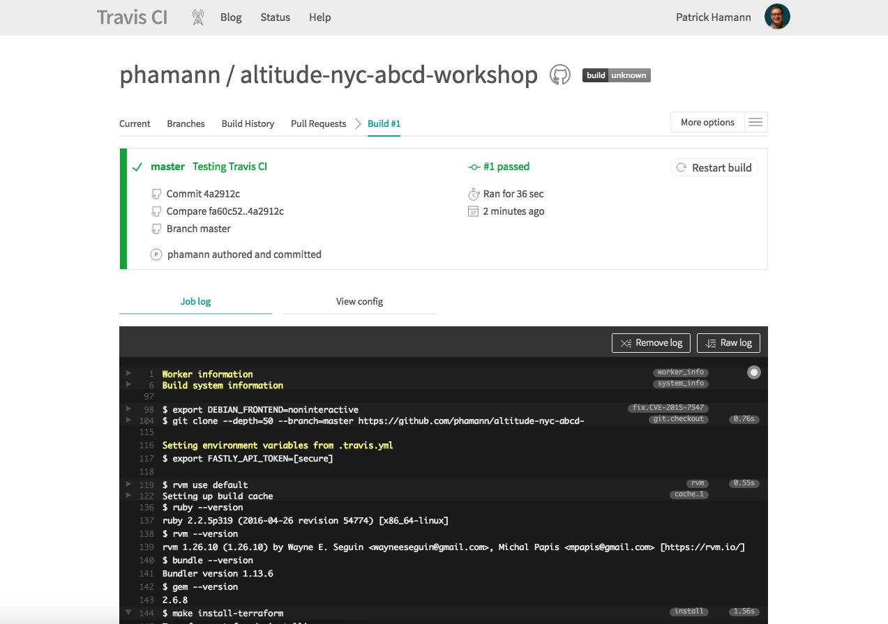
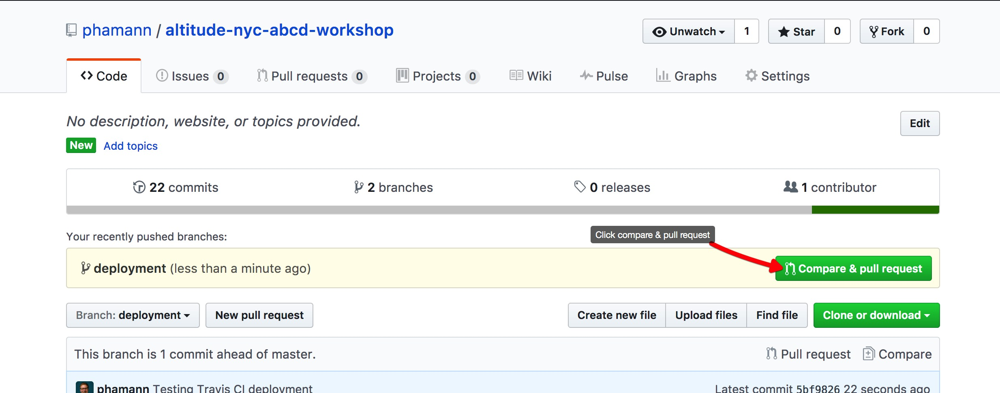

## 2. Configure continuous deployment with Travis

Now that we have defined our Fastly service using Terraform locally; we want to be able to reliably reproduce the infrastructure configuration in a continuous integration environment and deploy our changes to the service every time we check our config into version control such as GitHub. To achieve this we are going to use the open-source tool [Travis CI](https://travis-ci.org/).

Travis CI provides a hosted build environment and default set of steps to test, build and deploy project artefacts. You can customize any step in this process in a `.travis.yml` [yaml](http://yaml.org/) file in the root of your repository. Travis uses the file to learn about your project and how you want your builds to be executed.

### 2.1 Setup Travis 
1. Sign in to [Travis CI](https://travis-ci.org/auth) with your GitHub account, accepting the GitHub [access permissions confirmation](https://docs.travis-ci.com/user/github-oauth-scopes).

2. Once you’re signed in, Travis will synchronize your repositories from GitHub, go to your [profile](https://travis-ci.org/profile) page and enable Travis CI for your workshop repository `github.com/<USERNAME>/altitude-nyc-abcd-workshop` by toggling the associated switch.


> _Note: you may need to get Travis to sync with GitHub again._


### 2.2 travis.yml configuration
Once Travis is configured and authorised for your repository we can add a `.travis.yml` file. This declares the actions we'd like Travis perform in the CI environment whenever we change our configuration.

Edit the file named `.travis.yml` within the root directory of our project using your text editor of choice.

A build on Travis CI is made up of three steps, all of which can be customized using the the yaml declaration format inside our `.travis.yml` file:

1. `install:` install any dependencies required
2. `script:` run the build script
3. `deploy:` deploy the artefacts

> _Note:_
> There are actually more than 3 steps including some optional ones. The complete build lifecycle and hooks and information on how to customize them further can be found on the within the [Travis docs](https://docs.travis-ci.com/user/customizing-the-build#The-Build-Lifecycle).

Add the following steps to your `.travis.yml` file to customize the build: 

```yml
# We require the sudo command
sudo: required
# Cache the Terraform binary and our local state after each build
cache:
- directories:
  - "$HOME/terraform"
# Run make install command to fetch Terraform binary
install: make install-terraform
# Run Terraform plan
script: terraform plan -var fastly_api_token=$FASTLY_API_TOKEN ./terraform
```

The first three steps `sudo`, `cache`, and `install` tell Travis to install and cache the Terraform binary using the predefined [`make install-terraform`](../Makefile) command provided in the root of our repository. The `script` step should be familiar, it's the `terraform plan` command that we ran in the first exercise.

### 2.3 Encrypt Fastly API token
You may have noticed that we are passing an environment variable called `$FASTLY_API_TOKEN` to the Terraform `plan` command in our `script` build task. Whilst this works locally (we set it in exercise #1) this will not work in Travis CI as the variable won't be defined. Therefore, we need to pass the value to Travis via our `.travis.yml` file.

However, for obvious security reasons its a very bad idea to store any sensitive data such as our API token in plain-text within our source code. Especially on an open-source project like this. Fortunately Travis [provides a way to encrypt](https://docs.travis-ci.com/user/environment-variables/#Encrypting-environment-variables) and store secrets in the yaml file using public/private key signing.

Using the Travis binary (installed during setup) run the following command to add your token to the Travis file:
```sh
$ travis encrypt FASTLY_API_TOKEN=<YOUR_TOKEN> --add
```
Your `.travis.yml` file should now have an env declaration at the bottom of the file and should look something like this:
```yml
env:
  global:
    secure: DZSeoNfvqC90Kk1vUEsXlRcINUf9SFxWrK6JRciU2sQMW3SxQrAWLm+cmVs9a2sljUyYA9ZL0EUYC3
```


### 2.4 Add, commit, push, and build
To get Travis to trigger our newly defined build in CI we need to add the changed files in our working directory and push them to GitHub. Travis will observe the change to our repository and automatically start a build to run our `install` and `script` commands defined in the `.travis.yml` in the CI environment.

```sh
$ git add -A
$ git commit -m 'Testing Travis CI'
$ git push
```

Wait for Travis CI to run a build on your fork of the `altitude-nyc-abcd-workshop` repository. You can view the output and build status by navigating to: `https://travis-ci.org/<USERNAME>/altitude-nyc-abcd-workshop`. **Click on the branches tab if the build has not started yet**. Depending on the time of day this may take some time.

You should have see the output of our `terraform plan` in the job log tab:


### 2.5 Continuously deploy:
Now that we have Travis continuously integrating our changes whenever we push changes to our terraform configuration to GitHub, we can use the `deploy:` step inside `.travis.yml` to actually apply our changes to our Fastly service in production.

Add the following declaration the bottom of your `.travis.yml` file:

```yml
deploy:
# The deploy will be a simple script command
- provider: script
  # don't cleanup the build aretfacts before deployment
  skip_cleanup: true
  # run the terraform apply command
  script: terraform apply -var fastly_api_token=$FASTLY_API_TOKEN ./terraform
  # only run this deploy step when merging into master
  on:
    branch: master
```

The `script:` declaration inside the deploy block is the command that Travis will execute when running the `deploy` step. Here we have simply ran our `terraform apply` command as per the [last exercise](1.md#17-terraform-apply):
```yml
  script: terraform apply -var fastly_api_token=$FASTLY_API_TOKEN ./terraform
```

As we only want to deploy the changes to our service once we are satisfied with them (such as tests passing in the `script` step, peer reviewed by a colleague etc.) via a pull request into the master branch. We can tell Travis to only deploy the changes on a merge into the `master` branch via the `on:` declaration of the deploy block. I.e. only perform "this" action on "this" branch.
```yml
  on:
    branch: master
```

To test our deployment we need to make a new branch of our repository and push our changes to the `.travis.yml` file.
```sh
$ git checkout -b deployment
$ git add -A
$ git commit -m 'Testing Travis CI deployment'
$ git push origin deployment
```

Raise a new pull request for the branch changes in GitHub and merge it:
1. Navigate to the repository on GitHub and click "Compare & pull request"

2. Fill out the PR form title and description. _Note: ensure we are merging into the base master of our forked repo and not the upstream master_.

3. Click the "Merge pull request" button


If you jump back over to travis-ci.com you should now be able to watch the build of the `master` branch with our newly added deployment step creating our Fastly service. 

You should see the `apply` output in the build log.


### 2.6 Celebrate! 🎉
If your configuration was successfully applied via Travis CI you should be able to `curl` your newly created service:
```sh 
$ curl -v http://<YOUR SERVICE DOMAIN>.global.prod.fastly.net/index.html

HTTP/1.1 200 OK
Cache-Control: public, max-age=3600
Content-Type: text/html
Content-Length: 11651
Connection: keep-alive
X-Served-By: cache-lcy1136-LCY
X-Cache: HIT
X-Cache-Hits: 1
```
If you don't believe this you can even login to the Fastly web interface and look at your configuration.


